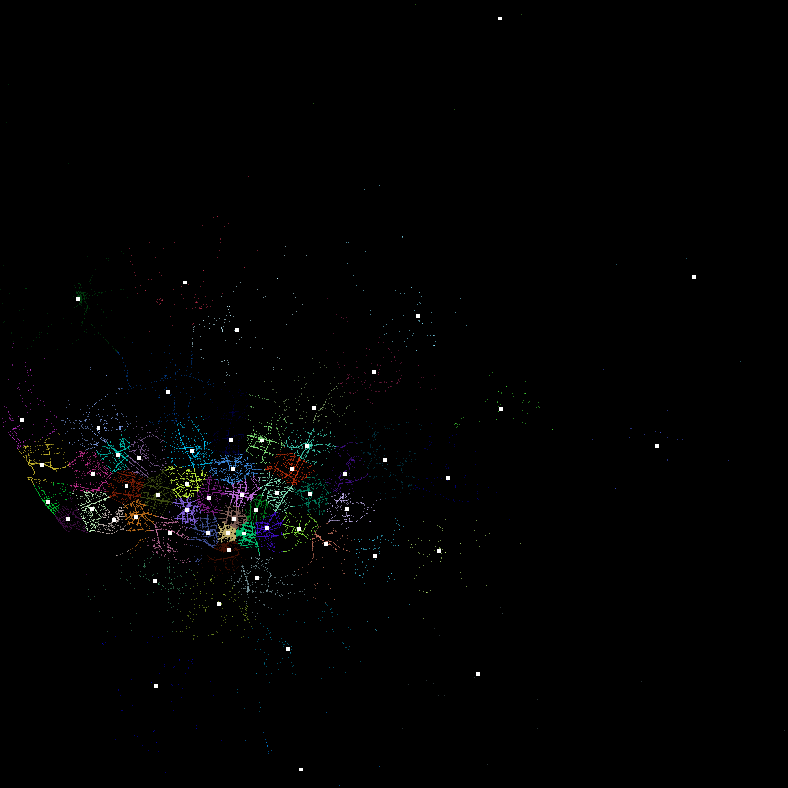
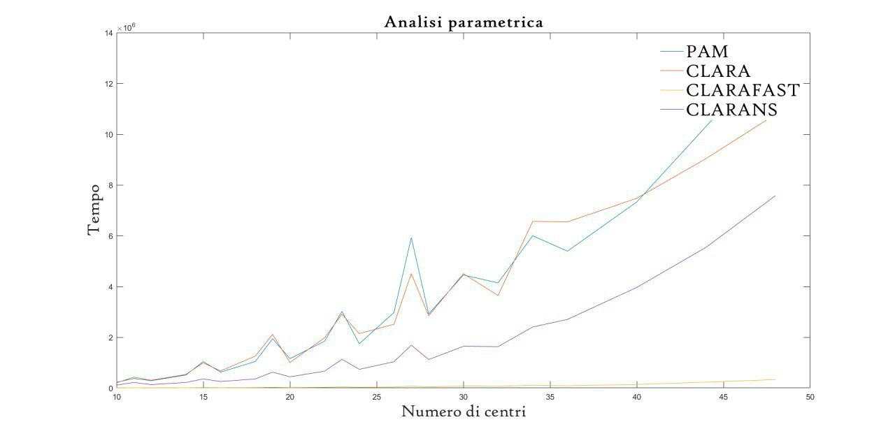
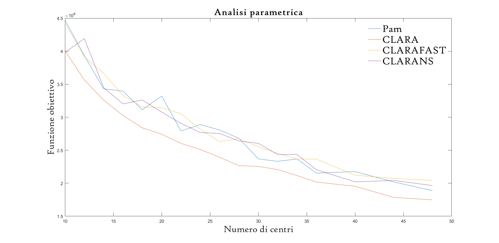

# Facility location problem analysis (Porto Taxi stand location)

During this project we have implemented and compared different clustering algorithms, in order to solve the facility location problem. The report [here](report_finale.pdf) (italian).

An example of the clusters found with the k-means algorithm.

  

We have shown that using a sample of the data set can be really effective. CLARAFAST is clearly faster than the other methods and it still achieve the same cost in the objective function.

